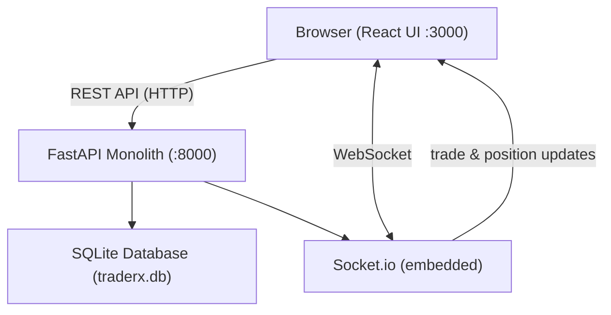

# Legacy Architecture — TraderX Monolith

This document describes the current architecture of the TraderX trading platform. TraderX is a **legacy monolithic application** built as a single Python/FastAPI process serving all trading functionality. It was consolidated from a distributed microservices architecture into a single deployable unit and carries significant technical debt by design.

---

## System Overview

TraderX is a single Python/FastAPI monolith that serves all trading functionality through one process:

- **Account management** — create, update, and query trading accounts and account users
- **Trade submission and processing** — submit trade orders, validate, process, and settle trades synchronously
- **Position tracking** — maintain and query net holdings per account and security
- **Reference data** — S&P 500 stock ticker lookup from a CSV file loaded into memory
- **People directory** — user/person lookup from a JSON file loaded into memory
- **Real-time updates** — Socket.io server embedded in the same ASGI process for pushing trade and position updates to connected frontends

The backend runs on **uvicorn** (ASGI) at port `8000` by default. The frontend is a separate React application served on port `3000`.

---

## Architecture Diagram

```
┌─────────────────────────────────────────────────────────────────┐
│                         Browser                                 │
│                     (React UI :3000)                            │
└──────────┬──────────────────────────────────┬───────────────────┘
           │ HTTP (REST API)                  │ WebSocket
           ▼                                  ▼
┌─────────────────────────────────────────────────────────────────┐
│                  FastAPI Monolith (:8000)                        │
│                                                                 │
│  ┌──────────────┐  ┌──────────────┐  ┌───────────────────────┐  │
│  │  /account/*   │  │  /trade/     │  │  /positions/*         │  │
│  │  /accountuser/│  │  /trades/*   │  │                       │  │
│  └──────┬───────┘  └──────┬───────┘  └───────────┬───────────┘  │
│         │                 │                       │              │
│  ┌──────┴───────┐  ┌──────┴───────┐              │              │
│  │ account_     │◄►│ trade_       │──────────────┘              │
│  │ service.py   │  │ processor.py │ (cross-domain queries)      │
│  └──────────────┘  │ (god service)│                             │
│                    │ 1047 lines   │                             │
│  ┌──────────────┐  └──────┬───────┘  ┌───────────────────────┐  │
│  │ /stocks/*    │         │          │ Socket.io Server       │  │
│  │ /people/*    │         ├─────────►│ (embedded in process)  │  │
│  │ (ref data +  │         │          │ real-time push         │  │
│  │  people svc) │         │          └───────────────────────┘  │
│  └──────────────┘         │                                     │
│                           ▼                                     │
│  ┌──────────────────────────────────────────────────────────┐   │
│  │              SQLAlchemy ORM + SQLite                      │   │
│  │  ┌──────────┐ ┌──────────────┐ ┌────────┐ ┌───────────┐ │   │
│  │  │ accounts │ │ account_users│ │ trades │ │ positions │ │   │
│  │  └──────────┘ └──────────────┘ └────────┘ └───────────┘ │   │
│  │          (all tenants in same tables via tenant_id)       │   │
│  └──────────────────────────────────────────────────────────┘   │
│                                                                 │
│  ┌──────────────────────────────────────────────────────────┐   │
│  │              Global Config (config.py)                    │   │
│  │  Mutable runtime state, tenant rules, env vars           │   │
│  │  Imported via `from app.config import *` everywhere      │   │
│  └──────────────────────────────────────────────────────────┘   │
└─────────────────────────────────────────────────────────────────┘
```



---

## Shared Multi-Tenant Database

The application uses a **single SQLite database** (`traderx.db`) accessed through SQLAlchemy ORM. All tenants share the same tables, separated only by a `tenant_id` column.

### Tables

| Table | Primary Key | Tenant Isolation |
|---|---|---|
| `accounts` | `id` (auto-increment) | `tenant_id` column |
| `account_users` | composite (`account_id`, `tenant_id`, `username`) | `tenant_id` column |
| `trades` | `id` (auto-increment) | `tenant_id` column |
| `positions` | composite (`account_id`, `tenant_id`, `security`) | `tenant_id` column |

### Tenant Configuration

Three demo tenants are pre-seeded: `acme_corp`, `globex_inc`, `initech`. The active tenant is determined by the `X-Tenant-ID` HTTP header, falling back to the `DEFAULT_TENANT` environment variable (default: `acme_corp`). There is **no row-level security**, no schema isolation, and no runtime isolation between tenants.

---

## Tight Coupling Between Modules

### Cross-Domain Queries

The `trade_processor.py` god service directly queries account tables to validate trades:

- `validate_account_exists()` — queries the `accounts` table directly instead of calling account_service
- `validate_account_has_users()` — queries the `account_users` table directly
- `get_account_portfolio_summary()` — joins data from `accounts`, `trades`, and `positions` tables in a single cross-domain aggregation

### Circular Dependencies

`trade_processor.py` and `account_service.py` have a circular dependency:

- `trade_processor` imports `Account` and `AccountUser` models for cross-domain queries
- `account_service` imports `count_trades_for_account` from `trade_processor` (via lazy import to avoid import-time failure)

### Inconsistent Service Layer Usage

Some route handlers use the service layer, others bypass it with inline SQLAlchemy queries:

- `GET /trades/` uses a raw inline query (bypasses `trade_processor.get_all_trades()`)
- `GET /trades/{account_id}` uses the service layer (`trade_processor.get_trades_for_account()`)
- `GET /positions/*` endpoints use raw inline queries (bypasses trade_processor position functions)
- `GET /account/{account_id}` directly queries the positions table for portfolio summary

---

## God Service: `trade_processor.py`

The `trade_processor.py` module is **1,047 lines** and handles nearly all business logic:

| Responsibility | Functions |
|---|---|
| **Trade validation** | `validate_trade_request()`, `validate_account_exists()`, `validate_account_has_users()`, `validate_security_exists()` |
| **Trade processing** | `process_trade()` — the main orchestration function |
| **Trade state machine** | `can_transition()`, `transition_trade_state()` |
| **Position management** | `update_position()`, `get_current_position_quantity()`, `get_positions_for_account()`, `get_all_positions()` |
| **Socket.io publishing** | `publish_trade_update()`, `publish_position_update()`, `publish_trade_and_position()` |
| **Reporting/aggregation** | `get_account_portfolio_summary()`, `get_tenant_trading_summary()`, `get_trade_volume_by_date()`, `get_top_traders()`, `get_position_concentration()` |
| **Tenant-specific rules** | `get_max_accounts_for_tenant()`, `check_tenant_account_limit()`, `get_tenant_trade_restrictions()`, `apply_tenant_specific_rules()` |
| **Maintenance operations** | `settle_pending_trades()`, `cancel_stale_trades()`, `recalculate_positions()` |
| **Audit/history** | `get_recent_trades_audit()`, `get_trade_history()` |
| **Cross-domain helpers** | `get_account_details_for_trade()`, `validate_user_can_trade()`, `get_account_display_name()` |

---

## No Containerization

There are no Dockerfiles, no `docker-compose.yml` for the monolith, and no container build pipeline. The application runs directly on the host machine using Python and Node.js runtimes.

---

## Manual Deployment

Deployment is handled via `deploy.sh`, a shell script that:

1. Installs Python dependencies with `pip install`
2. Runs database seeding
3. Starts the backend with `python run.py`
4. Installs frontend dependencies and builds the React app
5. Serves the frontend with `npx serve`

There is no blue-green deployment, no rollback mechanism, and no health check verification in the deployment process.

---

## No CI/CD Pipeline

There are no GitHub Actions workflows, no automated test pipeline, no linting checks, and no automated deployment triggers for the monolith. All testing and deployment is manual.

---

## No Tenant Isolation

| Layer | Isolation |
|---|---|
| **Runtime** | None — single process serves all tenants |
| **Database** | None — single SQLite file, shared tables, `tenant_id` column only |
| **Configuration** | None — shared `config.py` with global mutable state |
| **Network** | None — single port, single process |
| **Secrets** | None — all tenants share the same environment variables |

The `X-Tenant-ID` header is the only mechanism for identifying the current tenant. There is no authentication, no authorization, and no validation that a request is allowed to access a given tenant's data.

---

## Known Technical Debt

The following anti-patterns are **intentional** and present in the codebase by design:

### 1. Global Mutable Configuration (`config.py`)

- Every module imports config via `from app.config import *`
- `CURRENT_TENANT` is a mutable global variable modified at runtime via `set_current_tenant()`
- `_runtime_state` dict is mutated from multiple modules (`total_trades_processed`, `last_trade_timestamp`, etc.)
- `KNOWN_TENANTS` list is appended to at runtime when new tenants are encountered

### 2. Inconsistent Service Layer Usage

- Some endpoints use `account_service` and `trade_processor` functions
- Other endpoints issue raw SQLAlchemy queries inline in route handlers
- No consistent pattern for when to use vs. bypass the service layer

### 3. Business Logic Mixed with Database Access

- `trade_processor.py` combines validation logic, state transitions, position calculations, Socket.io publishing, reporting queries, and audit logging in a single module
- No separation between domain logic and persistence layer
- Trade state machine, position arithmetic, and database operations are interleaved in `process_trade()`

### 4. Circular Dependencies

- `trade_processor.py` imports models used by `account_service.py`
- `account_service.py` lazily imports `count_trades_for_account` from `trade_processor.py`
- Resolved at runtime but creates fragile import ordering requirements

### 5. Tenant-Specific Business Rules in Config

- `TENANT_MAX_ACCOUNTS`, `TENANT_ALLOWED_SIDES`, `TENANT_AUTO_SETTLE` are defined as dicts in `config.py`
- Business rules are coupled to configuration rather than being encapsulated in domain logic
- Adding a new tenant requires modifying the config module

### 6. No Error Boundaries

- Socket.io publish failures are caught but silently logged
- Database errors in seeding propagate as unhandled exceptions
- No circuit breaker, retry logic, or graceful degradation

### 7. SQLite as Production Database

- SQLite is a single-writer, file-based database not designed for concurrent multi-tenant production workloads
- No connection pooling, no read replicas, no backup strategy
